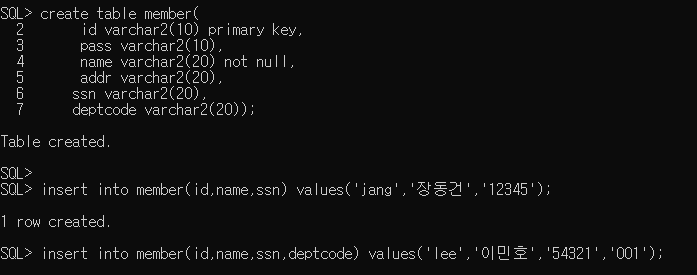
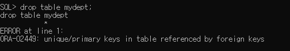
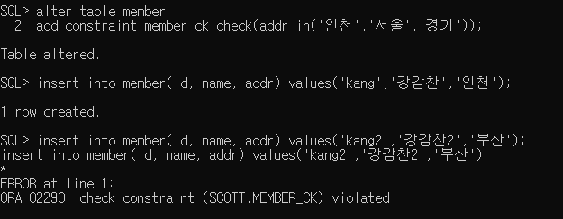
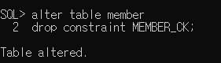
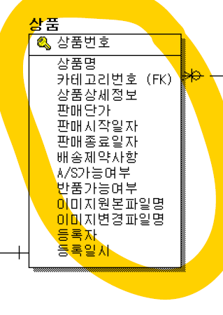

# DBMS 04

## 제약조건

1. not null : null이면 안됌
2. unique  : 중복 부락
3. primary key
4. foreign key  : primary key랑만 할 수 있음
5. check : 처음부터 데이터 입력되는 값을 제한을 둔다.

> 실제로 parent값에 없는걸 연결했기 때문에 오류

> foreignkey부터 삭제하고 참조하는 키가 없게 하고 나서 지워야함

parent table과foreignkey의 관계

: 관계형 데이터베이스에서 정규화에 의해서 중복되는 데이터를 따로 테이블로 빼서 만들어서

유일한 값 밖에 없는 테이블에 기본키를 설정하고 참조하는 테이블을 만든다.

기본키를 가지고 있는 것은parentkey, 참조하는 값을 가지고 있는 테이블은 childrenkey

=>제약조건을 제거하는게 가장 좋은 방법이다.

 check : 한정된 조건을 부여함.

​			where조건절에서 사용하던거 다 사용가능 -> 값에 대해서 제한을 두기 때문에.

> 제약조건 삭제

## 시퀀스

오라클에서 제공하는 오브젝트.

하나하나 순차적으로 증가해야하는 값이 저장되는 컬럼이 필요한 경우 사용해야함

EX) 

image-20191223130344072

alter table tb_order
add constraint for_mem_ord foreign key(mem_id)
references tb_mem(mem_id);