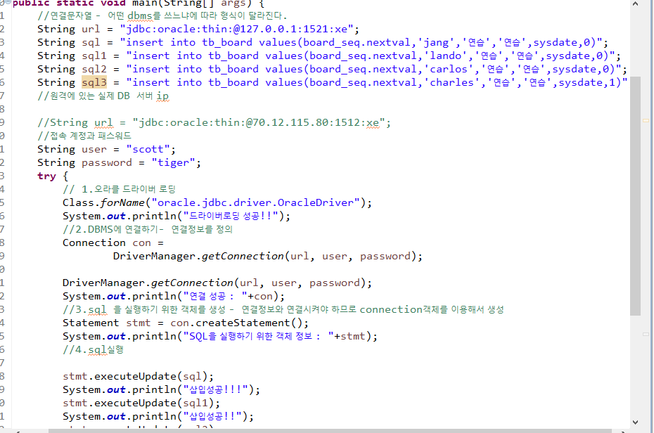

# JDBC

static은 이름으로 접근 가능

다음과 같은 순서로 JDBC를 적용합니다

.**1. 드라이버로딩**** >jvm에서 어떤 dbms를쓰는지 인식시켜주는 과정

2 커넥션설정하기

Statement객체 생성하기

1. 4. SQL문실행하기5. 결과처리6. 자원반납

T4CConnection : 오라클의 정보를 가지고 있는 클래스??

=> 오라클과 접속을 성공하면 오라클의 연결정보를 가지고있는 클래스를 리턴함.

## Statement

SQL을 실행하는 역할

## 실제코드

~~~
String url = "jdbc:oracle:thin:@127.0.0.1:1521:xe";
		String sql = "insert into tb_board values(board_seq.nextval,'jang','연습','연습',sysdate,0)";
		String user = "scott";
		String password = "tiger";
		try {
			// 1.오라클 드라이버 로딩
			Class.forName("oracle.jdbc.driver.OracleDriver");
			System.out.println("드라이버로딩 성공!!");
			//2.DBMS에 연결하기- 연결정보를 정의
			Connection con = 
					DriverManager.getConnection(url, user, password);
			
			DriverManager.getConnection(url, user, password);
			System.out.println("연결 성공 : "+con);
			//3.sql 을 실행하기 위한 객체를 생성 - 연결정보와 연결시켜야 하므로 connection객체를 이용해서 생성
			Statement stmt = con.createStatement();
			System.out.println("SQL을 실행하기 위한 객체 정보 : "+stmt);
			//4.sql실행
			
			stmt.executeUpdate(sql);
			System.out.println("삽입성공!!!");
			stmt.executeUpdate(sql1);
			System.out.println("삽입성공!!");
			stmt.executeUpdate(sql2);
			System.out.println("삽입성공!");
			stmt.executeUpdate(sql3);
			System.out.println("삽입성공");
			
		}catch(ClassNotFoundException e) {
			System.out.println("드라이버 로딩 실패!");
		}catch(SQLException e) {
			System.out.println("연결 실패  : "+e.getMessage());
		}
	}

~~~

