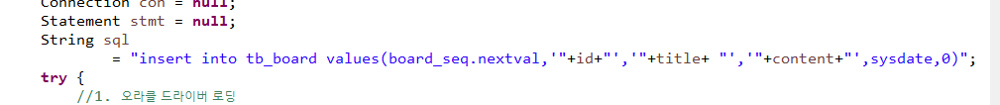
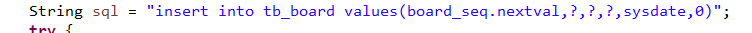
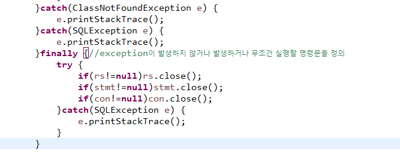

# JDBC02

## JDBC란

자바로 DBMS연동하는 기술

(SQL문을 자바로 만든 시스템을 통해 실행할 수 있도록 만들어진 자바의 기술)

### 1. 처리 순서

1. JDBC드라이버를 제조사 홈페이지에서 다운로드 합니다.

   =>C:\oraclexe\app\oracle\product\11.2.0\server\jdbc\lib 폴더에 있는 ojdbc6.jar

2. JVM이 인식할 수 있는 위치에 연결

   1)이클립스를 사용하는 경우(APPLICATION)

   - 작업 중인 프로젝트 선택
   - 프로젝트에서 단축메뉴 선택 ->build path ->Configure Build path
   - 선택창에서 3번째 탭인 libraries에서 ojdbc.jar를 등록

### api

 

1.  오라클 드라이버 로딩

   => JVM 드라이버내의 API를 접근해서 사용할 수 있도록  Class클래스의 forName메소드를 이용해서 핵심 클래스를 로딩하는 작업

   [문법]

   Class.forName("DBMS드라이버의 핵심클래스명")

    =>패키지명까지 명시 

2. DBMS에 연결하기

   =>DriverManager클래스의 getConnection 메소드를 통해 작업

   1) static 메소드 이므로 클래스 이름으로 액세스

   2) throws SQLException하고 있고 SQLException은 RuntimeException의 하위가 아니므로 try~catch를 이용해서 exception에 대한 처리를 해야한다.

   3) 매개변수

    url : DBMS내부에서 인식할 연결 문자명(어떤 DBMS 를 쓰냐에 따라 달라진다.)

    		[오라클]

   ​		jdbc:oracle:thin:@70.12.115.80:1512:xe

   ​      (-----------------------)(--------------------)(-----)(----)

   오라클에서 사용하는프로토콜,DBMS가 설치되어있는 PORT있는 PC의 ip, port,

   ​      [mysql]

    	 jdbc:mysql://ip:port/데이터베이스명(port - 3306)

   user : 접속 계정

   password : 접속할 계정의 패스워드

   4) 리턴타입

   ​	연결정보를 java.sql.Connection타입으로 리턴

   ​	DriverManager의 getConnection메소드를 이용하면 DBMS에 연결정보를 객체로 만들어서 리턴한다.

   ​	연결객체의 타입은 java.sql.Connection이지만 어떤 DBMS를 접속햇냐에 따라 Connection의 하위 객체가 리턴

   ​	내부에서는 접속된 DBMS회사에서 제공하는 라이브러리 속 Connection이 리턴되도록 다형성이 적용되어있다.

   5) 사용방법

   ​	 Connection con = DriverManager.getConnection(url,user,password)

   ​		=> 어떤 DBMS를 쓰냐에 따라 다르게 리턴되는 Connection객체를 con이라는 참조변수를 통해 접근할 수있도록 할당

3. SQL을 실행하는 역할을 담당하는 Statement객체 생성

   Statement                                       : 정적 sql실행 

   ​       ^                                                   보안에 취약 -SQLInjection에 취약

   PreparedStatement                      : 동적SQL을 실행

   ​       ^                                                 시큐어코딩에 적합

   CallableStatement                        : 각 DBMS에 특화된 SQL을 실행

   ​                                                           Ex) 오라클 : PL-SQL

   

   

   ->sqlinjection

   1)  Statement객체를 이용

   ​      Connection객체에 있는 createStatement메소드를 통해 생성

   ​      Connection정보를 유지해야한다.

   ​	 Statement stmt = con.createStatenment()

   ​    ==========

   ​       java.sql.Statement 타입이지만

   ​      드라이버 파일에 포함된 Statement 객체가 리턴

   

   2) PreparedStatement객체를 이용

   ​	=> 동적 SQL문을 사용해야 하기 때문에 SQL이 실행되는 과정은 

     	- 쿼리문을 읽고 분석
     	- 컴파일
     	- 실행

   Statement는 위의 단계를 모두 반복해서 실행하고 작업하지만, PreparedStatement는 한번 실행하고 캐쉬에 저장하고 캐쉬에서 읽어서 작업한다.

   PreparedStatement는 sql문을 실행하는 방식이 sql문을 미리 파싱한 후 동적으로 바인딩해서 작업해야 하는 값들만 나중에 연결해서 인식시키고 실행한다.

     - sql문을 작성할 때 외부에서 입력받아서 전달할 부분을 ?로 정의한다.

     - sql문을 미리 파싱해야 하므로 실행할 때 sql을 전달하지 않고 PreparedStatement객체를 생성할 때 sql문을 전달한다.

       PreparedStatement ptmt = con.prepareStatement(sql문)

   

   - ?에 값을  셋팅

     PreparedStatement객체에 정의되어 있는 setXXXX메소드 이용

     ResultSet과 동일한 방식으로 메소드를 구성

     setXXXXXX(index, 값)

     =======   ----====  ===

     컬럼의 타입 ?순서      |_ 컬럼에 설정할 값

     ​                      1부터시작

     오라클 타입과 매칭되는 setXXXX메소드

     ? : Char,varchar2  = > setString(1,"XXXXX")

     ​     number,integer = > setInt(1,0000)

     ​    소숫점잇는 number => setDouble(1,0.0)

     ​     date           => setDate(1,java.sql.Date 객체)

   - 실행 메소드 호출

     - insert,delete, update

       int result = ptmp.executeUpdate()

     - select

       ResultSet rs = ptmt.executeQuery()

     - 

4. SQL 실행

   1) Statement를 이용

   - executeUpdate :  insert, update, delete문을 실행

     int 결과값 = stmt.excuteUpdate(sql문)

     =========                                   ==========

     sql문 실행 결과                            insert, delete, update

     몇개의 row가 변경 됐는지

     리턴

   - executeQuery : select문을 실행

     ​							select문의 실행 결과로 리턴되는 2차원 표를 자바에서 사용할 수 있도록

     ​							모델링해 놓은 객체가 ResultSet이고,

     ​							executeQuery메소드는 결과로 ResultSet객체를 반환하므로 

     ​							이 객체를 반호나받을 수 있도록 정의한다.

     ​		ResultSet rs = stms.executeQuery("sql문")

   

   

   

   2) PreparedStatement이용

      =>3번참조

1. 결과값 처리

   1) insert,delete,update 모두 동일

    => int

   2) select

   - select문의 실행결과로 반환되는 ResultSet을 참조할 수 있도록 정의 

     ResultSet rs = stmtm.executeQuery("sql문")

   - ResultSet안에서 모든 레코드를 읽어서 처리할 수 있도록 반복문을 이용해서 처리.

     처음 반환되는 ResultSet에서 Cursor가 레코드에 위치하지 않으므로 Cursor를 ResultSet안의 레코드에 위치할 수 있도록 내부 메소드를 이용해서 처리한다.

     While(rs.next()){

     ​        =========> 다음레코드로 Cursor를 이동하고 레코드가 존재하면 True를 리턴하고 존재하지 않으면 False를 리턴한다.

     

     }

   - 레코드의 값을 읽는다.

     => 한번에 하나의 컬럼만 읽을 수 있다.

     ​     ResultSet내부에서 제공되는 getXXXXX메소드르 이용

     ​			rs.getXXXXXX(1)

     ​                     ===========

     ​                     데이터타입 |_ 테이블에 존재하는 컬럼의 원래 순서가 아니라 

     ​                                               조회된 컬럼의 순서(인덱스는 1부터 시적)

     오라클(DBMS)의 타입과 매칭되는 자바의 타입으로 메소드명이 구성

     varchar2 or char로 정의된 컬럼값 => getString(컬럼의 순서or컬럼명)

     소숫점 없는 number or integer => getInt(컬럼의 순서 or컬럼명)

     소숫점이 있는 number =>getDouble(컬럼의 순서 or 컬럼명)

     날짜데이터   => getDate(컬럼의 순서 or컬럼명)

     

     while(rs.next()){

     ​           ======

     ​              조회된 테이블의 모든 레코드에 반복 작업 수행	

     ​	SYSOUT(rs.getString(1)) -> 조회된 레코드의 첫 번 째 컬럼값

        sout(rs.getString("ename")) ->조회된 레코드의 컬럼명이 ename인 컬럼의 값.

     }

2. 자원반납

   자원을 반납하지 않으면 계속 메모리가 할당되어있는 상태

   ResultSet, Statement, Connection 모두 반납해야 한다.

   Close메소드를 이용해서 자원해제

   가장 마지막에 만들어진 객체부터 해제

   

<일반적인 처리순서>

1. 드라이버 파일을 JVM이 인식할 수 있는 위치에 연결

2. 드라이버 로딩

3. DBMS연결

4. SQL을 실행하는 기능을 갖고있는 객체 생성

   =>SQL을 실행하는 역할 담당하는 객체 STATEMENT임

   =>CONNECTION으로 STATEMENT를 만들어내야한다.

5. SQL실행하기

   =>STATMENT라는 객체를 통해 연결정보로 가서 SQL실행